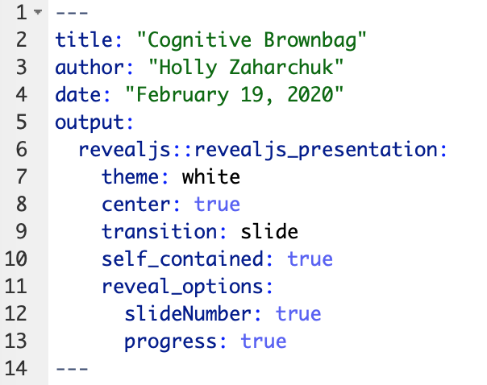
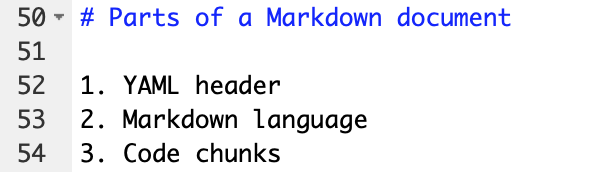
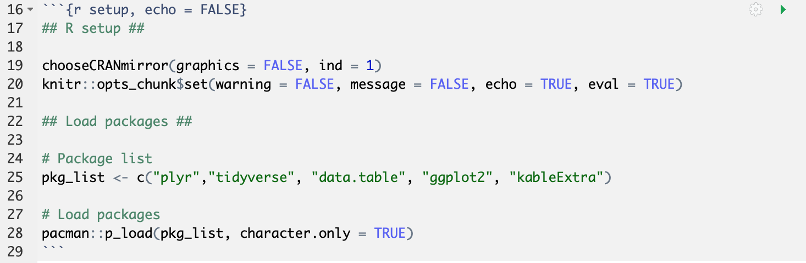

# Parts of a document {#intro}

1. YAML header
2. Markdown
3. Code chunks

## YAML header

The first part of your document is called the YAML header. This is where you set the global options for the output and formatting. 

In the example below, I show the YAML header for a set of `revealjs` slides. See Chapter \@ref(template) for more information on creating slides with this and other packages. I've included basic information, like the title and date, in addition to template-specific parameters, like whether there should be slide numbers or not. Section \@ref(yamlref) has more information on setting YAML formatting parameters.

```{r parts_example_yaml, echo=FALSE}

```

## Markdown {#markintro}

The plain text-formatting syntax of R Markdown allows for conversion to multiple document types. The image below shows an example of the basic syntax. \# denotes a header, with \## denoting a subheader and so on. The numbered list will behave like you would expect one to in Word. However, unlike Word, the actual numbers don't matter; I could've put all 1's here, and R Markdown would've formatted them for me. Go to Chapter \@ref(content) for more information on markdown syntax.

```{r parts_example_markdown, echo=FALSE}

```

## Code chunks {#chunkex}

Code chunks are one of the core features of R Markdown. Code chunks are set apart from the markdown sections by three backticks at the beginning and end. In curly brackets, you must also specify the coding language you want to use (here, it's R, with a lowercase r). You can add other arguments, like a name for the chunk (here, it's "setup"), or other chunk options (like "echo = FALSE" to prevent the code from appearing in the document). You can find a full list of chunk options [here](https://rstudio.com/wp-content/uploads/2015/03/rmarkdown-reference.pdf?_ga=2.148221175.1120335848.1588040224-1822605369.1586890951).

```{r parts_example_chunk}
# This is a chunk of R code that adds an image

```

There are multiple ways to run code chunks to test them in RStudio before creating your output. You can run code like you would in R by highlighting the relevant lines of code and hitting CTRL/command + enter. You can also hit the green "play" button in the upper right hand corner of the chunk to run that particular chunk. Each chunk is an island, so if you haven't run a previous chunk that contains some variable you need in a later chunk, it'll throw an error. At the top right of the open .Rmd document in RStudio, you'll also see a **Run** dropdown menu. There, you can choose different options for running certain code chunks.

Tip: you can use the chunk option "cache = TRUE" for very time-consuming chunks, but there are some catches as described [here](https://bookdown.org/yihui/rmarkdown-cookbook/cache.html).