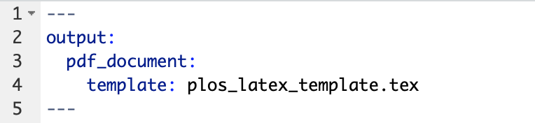
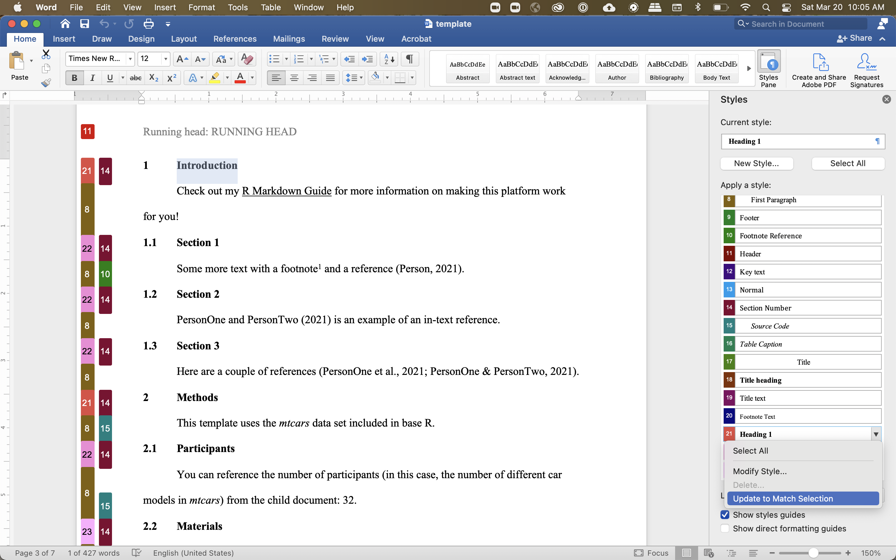

# Templates {@template}

1. Built-in templates
2. Templates from R packages
3. User-defined templates

## Built-in templates

- [Presentations](https://rmarkdown.rstudio.com/lesson-11.html)
  - ioslides and Slidy for HTML
  - Beamer for PDF
- [Shiny](https://bookdown.org/yihui/rmarkdown/shiny-documents.html) documents and presentations (interactive)

## R packages

- Presentations: [`revealjs`](https://cran.r-project.org/web/packages/revealjs/index.html)
- CVs: [`vitae`](https://github.com/mitchelloharawild/vitae)
- Academic posters: [`posterdown`](https://github.com/brentthorne/posterdown)
- APA articles: [`papaja`](https://github.com/crsh/papaja)
- Journal templates: [`rticles`](https://bookdown.org/yihui/rmarkdown/rticles-templates.html)
- HTML theme: [`prettydoc`](https://github.com/yixuan/prettydoc)

## User-defined templates

$\LaTeX$ templates (pay attention to \$ in templates)

```{r template_latex, echo=FALSE}

```

## User-defined templates

Word Document: use the Styles Pane and "Update to Match Selection" 

```{r template_word, echo=FALSE}

```