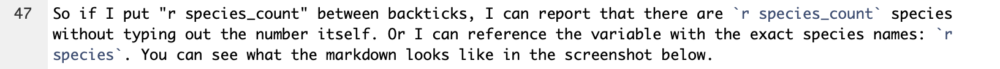

# Content {#content}

## Markdown overview

[R Markdown: The Definitive Guide](https://bookdown.org/yihui/rmarkdown/markdown-syntax.html) and this [R Markdown cheatsheet](https://rstudio.com/wp-content/uploads/2015/02/rmarkdown-cheatsheet.pdf) provide information on the typesetting capabilities of R Markdown. In general, R Markdown typesetting options include `*italics*`, `**bold**`, and `~~strike-through~~`. These are achieved by wrapping text in a certain number of asterisks or tildes. There are also `(parentheses)`, `[square brackets]`, and `"quotation marks"` that can have special functions in markdown, like creating hyperlinks: `[text](link)`.

With many of these typesetting characters, if you highlight the text you want to format (by clicking and dragging your cursor), you can just hit the character once to wrap the text automatically. This way, you don't have to go to the beginning and end of the text and place the characters individually.

Another note about R Markdown is that line spacing matters. For example, if I wanted to include bullet points after this sentence, they wouldn't render properly if I didn't hit enter twice before starting them. In other words, I need to have a full line of white space before bullet points and numbered lists. If you're having issues with your document rendering correctly, make sure you have line breaks between lists, paragraphs, and headers.

## Special characters

If you want any special characters in R Markdown, $\LaTeX$, or pandoc to appear as text, rather than having them perform some function, you need to "escape" them with a backslash. For example, pound signs/hashtags, backslashes, and dollar signs need to be preceded by a backslash. 

This also applies to any chunk outputs that contain strings, as with `knitr::kable` tables with $\LaTeX$ functions or characters (e.g., Greek letters like $\eta$ to report partial eta-squared or functions like `\textit{p}` to italicize the text). Sometimes you even need multiple backslashes, so you may have to play around to troubleshoot if they're not rendering correctly.

Speaking of $\LaTeX$, you can engage "math-mode" by putting dollar signs around $\LaTeX$ math commands. This way, you can include equations, International Phonetic Alphabet (IPA) symbols, and the like in R Markdown (even if you're not outputting to a PDF). For example, I can write $e = mc^2$ in a sentence like this just by wrapping the equation in a single set of dollar signs, or I can use two sets to center the equation: $$e = mc^2$$

## Inline R {#rintext}

A very useful aspect of R Markdown is that you can call R objects and functions in markdown or the YAML header by sandwiching them between backticks. For example, let's say I want to report on the names of the flower species in the [`iris` dataset](https://archive.ics.uci.edu/ml/datasets/iris).

```{r iris_example_1, message=FALSE, warning=FALSE}
# Pull species column from iris and get unique values in column
species <- iris %>% pull(Species) %>% unique()

# Print species variable
print(species)
```

Maybe I also want to save a variable with the number of species in this list.

```{r iris_example_2, message=FALSE, warning=FALSE}
# Get number of unique species
species_count <- length(species)

# Print number of species
print(species_count)
```

I can call `species` and `species_count` in the markdown text to reference these variables dynamically. Just as in a code chunk, I have to specify that I'm working with R code by including a lower-case r in the backticks with the variable. 

So if I put "r species_count" between backticks, I can report that there are `r species_count` species without typing out the number itself. Or I can reference the variable with the exact species names: `r species`. You can see what the markdown looks like in the screenshot below.

```{r content_intext_iris, echo=FALSE}

```