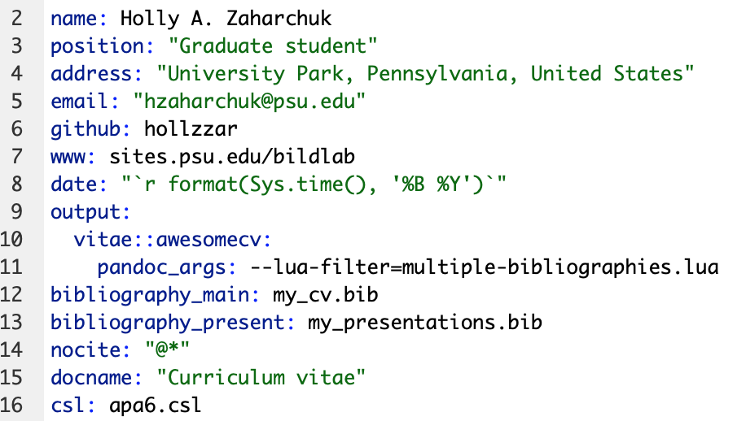
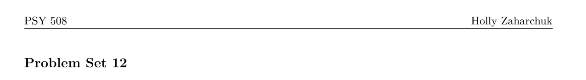
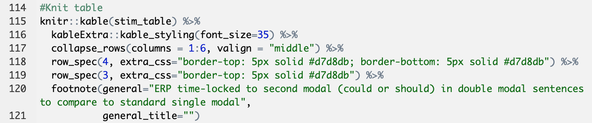
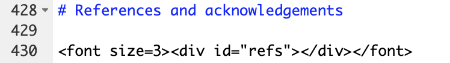
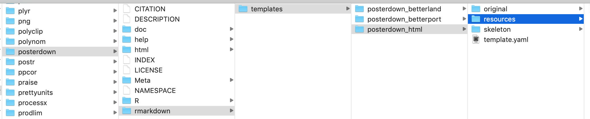

# Formatting

1. YAML parameters and references
2. Inline $\LaTeX$ and CSS code
3. Custom edits to templates

## YAML parameters

- [General YAML parameters](https://ymlthis.r-lib.org/articles/yaml-fieldguide.html)
- Template-specific parameters (look at package documentation)

## YAML references {#yamlref}

These files go in the same place as your .Rmd

- Bibliography: [.bib](https://rmarkdown.rstudio.com/authoring_bibliographies_and_citations.html) (I use BibDesk for my reference manager)
- Citation style language files: [.csl](https://github.com/citation-style-language/styles) (see my [CV](https://github.com/hollzzar/zaharchuk-cv) and [Psychonomics poster](https://github.com/hollzzar/psychonomics-poster) repos for customized APA 6 files)
- $\LaTeX$ styling: .cls
- HTML styling: .css
- Interacting with pandoc: .lua ([multiple bibliographies](https://github.com/pandoc/lua-filters/tree/master/multiple-bibliographies))

Example from [my CV](https://github.com/hollzzar/zaharchuk-cv) with both template-specific YAML parameters and YAML references

```{r format_example_ref, echo=FALSE}

```

## Inline $\LaTeX$&nbsp; and CSS code

- $\LaTeX$ with PDFs
  - Calling $\LaTeX$ packages
  - Using symbols: useful lists [here](https://www.rpi.edu/dept/arc/training/latex/LaTeX_symbols.pdf) and [here](https://www.tug.org/tugboat/tb17-2/tb51rei.pdf)
  - Using type-setting commands (e.g., \\vspace{12pt})
- [CSS](https://developer.mozilla.org/en-US/docs/Web/CSS) with HTML

## $\LaTeX$

Examples of calling packages in the YAML header and using inline functions from my stats homework (also see [Writing Your Thesis with R Markdown](https://rosannavanhespenresearch.wordpress.com/2016/03/30/writing-your-thesis-with-r-markdown-5-the-thesis-layout/))

```{r format_latex, echo=FALSE}
knitr::include_graphics("images/latex_packages.png")
knitr::include_graphics("images/latex_calls.png")
```

Stats homework output

```{r format_example_latex, echo=FALSE}

```

## CSS/HTML

Examples from [my Psychonomics poster](https://github.com/hollzzar/psychonomics-poster/blob/master/Psychonomics.Rmd)

```{r format_example_css, echo=FALSE}

```

```{r format_example_html, echo=FALSE}

```

## Editing templates

To make extremely custom edits to templates, sometimes you have to edit the template documents

1. Find out where your computer stores your R packages and edit the template there
2. If the template generates a style document (e.g., .cls) in the directory with your .Rmd file, you can usually edit that without going to the package

## Package documents

```{r template}
# Make dataframe with installed packages
pkgs <- installed.packages() %>%
  as.data.frame()

# Pull posterdown package 
pstr <- pkgs %>% 
  select(Package, LibPath, Version, Depends, Imports) %>%
  dplyr::filter(Package == "posterdown")

# Make table
kable(pstr) %>%
  kable_styling(bootstrap_options = "condensed", 
                font_size = 18)
```

## Package documents

- Save the original template and move it to a different location
- Make one change at a time
- Name the updated template with the same name in the same place as the original

```{r format_template, echo=FALSE}

```

## Directory documents

Knitting the `vitae::awesomecv` template created a .cls file that I could edit to change font sizes/colors

```{r format_template_dir, echo=FALSE}
knitr::include_graphics("images/template_dir.png")
```