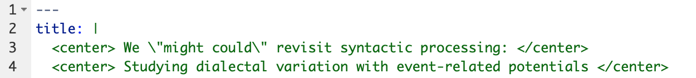
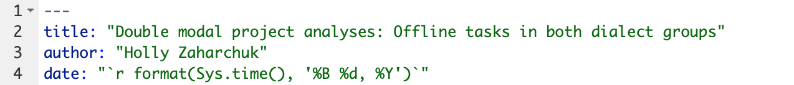
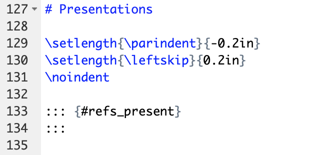
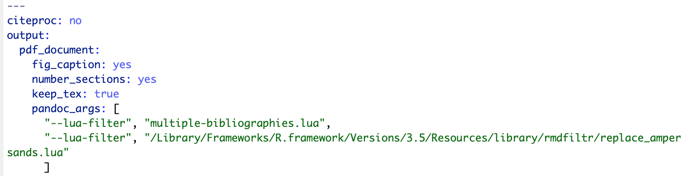
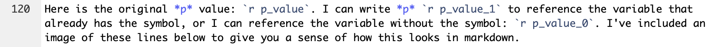

# Formatting {#format}

There are many ways to customize the formatting of an R Markdown document. In the YAML header, you can specify different parameter options or reference external documents. You can also edit templates directly in certain cases. For local formatting, you can include inline code in the markdown sections.

## YAML parameters

There are several [general YAML options](https://ymlthis.r-lib.org/articles/yaml-fieldguide.html) that you can include in the YAML header to format your documents. You can also add **params** to the YAML header that you can specify when you render your document and call in your code chunks to make [parameterized reports](https://rmarkdown.rstudio.com/developer_parameterized_reports.html%23parameter_types%2F). Some YAML options require quotation marks, while others don't. In general, if the YAML option is a string of text that you're specifying, like the title or your name, then it should be in quotes. If you're setting a programmatic option, like the output type, then it shouldn't be in quotes. 

For the string options, there's some custom formatting you can do. The first example below shows how you can center a title and force a line break. The second shows how you can automatically pull the date and time when you knit your document and format it in a particular way. This is actually R code that is embedded in a string by putting the function call between backticks with a lowercase r. You can use the same principle to put R code and functions in the text of an R Markdown document (see Section \@ref(rintext) for more information).

```{r formatting_yaml_example_1, echo=FALSE}


```

```{r formatting_yaml_example_2}
# Show date formatting code
# You can run ?Sys.time in the console for more information 
# on the options you can pass to format
format(Sys.time(), '%B %d, %Y')
```

There are also template-specific parameters, but you'll need to look at the specific package documentation to know what these are.

## YAML references {#yamlref}

In your YAML header, you can reference other documents for formatting and content.

### .bib

To cite references, you need to set the *bibliography* option in the YAML header. I use BibDesk for my reference manager, which creates a .bib file, or you can create a .bib file directly in $\LaTeX$. You can also construct a [.bib file](https://rmarkdown.rstudio.com/authoring_bibliographies_and_citations.html) through R. See Section \@ref(scholarex) or the [.Rmd file for my CV](https://github.com/hollzzar/zaharchuk-cv/blob/master/Zaharchuk_CV.Rmd) for examples with the `scholar` package.

By default, if you reference a .bib file, the references will appear at the very end of the document. This is usually fine, but sometimes you may want to control the placement of the references, as with a CV. In this case, you can use a .lua filter as described in Section \@ref(luaex) to place your references in a particular spot.

To create in-text citations, you'll use the cite key from your .bib file with the \@ symbol. Full information on citing syntax can be found [here](https://rmarkdown.rstudio.com/authoring_bibliographies_and_citations.html#citation_syntax). When you cite something from your .bib file, it will appear in your references section when you knit your document. If you want to include all of the references from your .bib file in your reference section, regardless of whether you've cited them or not in the document, set the **nocite** option in the YAML header to **"@\*"**.

### .csl

To determine the type of formatting for your references, you can include a citation style language or [.csl file](https://github.com/citation-style-language/styles). There are other ways to set the format of bibliographies, but a .csl file allows fine-grained control over citations that you can also customize. My [CV](https://github.com/hollzzar/zaharchuk-cv) repository has a customized APA 6 .csl file for arranging references in descending order by date. My [Psychonomics poster](https://github.com/hollzzar/psychonomics-poster) repository also has a customized APA 6 .csl to fix some small bugs.

### .cls and .css

You can include .cls files (not to be confused with the .csl files above) for $\LaTeX$ styling or .css files for HTML styling. You can see an example of the .cls file that formats my [CV](https://github.com/hollzzar/zaharchuk-cv) in Section \@ref(clsex). This guide itself uses .css files that you can find [here](https://github.com/hollzzar/rmarkdown-guide) to control the formatting.

### .lua {#luaex}

Sometimes, you need to interact with pandoc directly in order to achieve a particular formatting outcome. To do this, you need to use a .lua filter.

The [multiple-bibliographies.lua file](https://github.com/pandoc/lua-filters/tree/master/multiple-bibliographies) is incredibly useful. It allows you to use multiple bibliographies in one document, as I do in my [CV](https://github.com/hollzzar/zaharchuk-cv) (one for publications, another for conference presentations). Even if you don't have multiple bibliographies, using this .lua filter will allow you to place your reference section in a particular part of your document.

The [.Rmd file for my CV](https://github.com/hollzzar/zaharchuk-cv/blob/master/Zaharchuk_CV.Rmd) shows how to use multiple bibliographies in R Markdown. First, you need to add a name to each bibliography in the YAML header with an underscore. You can also see how I've referenced this .lua file in the **pandoc_args** option in the YAML header. For this document to knit properly, the .lua file needs to be in the same place as my .Rmd file.

```{r format_example_ref, echo=FALSE}
knitr::include_graphics("images/references_example.png")
```

Then, you can place the reference section for each bibliography in the appropriate place. This example also shows how you can alter the formatting locally for just the reference section with $\LaTeX$ commands.

```{r format_placement_ref, echo=FALSE}

```

Another very useful .lua file handles in-text APA citations. By default, pandoc uses "\&" for in-text citations where APA would require "and," even if you're using a .csl file for APA formatting. Rather than downloading a file like with *multiple-bibliographies.lua*, this file is already stored with pandoc: you just need to reference it. Follow [these instructions](https://cran.rstudio.com/web/packages/rmdfiltr/vignettes/replace_ampersands.html) to access and reference this .lua filter The example below from my Master's thesis shows how you can reference multiple .lua filter in one document.
  
```{r format_lua, echo=FALSE}

```

## Editing templates

To make extremely custom edits to templates, sometimes you have to edit the template documents directly. If the template generates a style document (e.g., .cls) in the directory with your .Rmd file, you can usually edit that without going to the package. Otherwise, you have to find out where your computer stores your R packages and edit the template there. 

### Directory documents {#clsex}

Some templates output formatting documents in your working directory. These are easier to access and edit. For example, knitting the `vitae::awesomecv` template created a .cls file that I could edit to change font sizes/colors.

```{r format_template_dir, echo=FALSE}
knitr::include_graphics("images/template_dir.png")
```

### Package documents

To find out where your packages "live," you can call `installed.packages()`. When you leave the parentheses blank (i.e., if you don't provide any arguments), as I've done below, the function will return all of the packages you have installed. I've stored them as a dataframe, and then filtered for an example. Here, I'm looking at the `posterdown` package.

```{r template, out.width='\\textwidth'}
# Make dataframe with installed packages
pkgs <- installed.packages() %>%
  as.data.frame()

# Pull posterdown package 
pstr <- pkgs %>% 
  select(Package, LibPath, Version, Depends, Imports) %>%
  dplyr::filter(Package == "posterdown")

# Make table
kable(pstr) %>%
  kable_styling(bootstrap_options = "condensed", full_width = FALSE, font_size = 12)
```

To edit package documents once you've located them, you should proceed with caution. Be sure to:

- Save the original template and move it to a different location (in the example below, I made the "original" folder and put the original template there)
- Make one change at a time, and then re-knit the document to see what changed
- Name the updated template with the same name in the same place as the original (here, in the "resources" folder)

```{r format_template, echo=FALSE}
knitr::include_graphics("images/template_package.png")
```

## Inline code

R Markdown supports inline code for custom formatting. 

### $\LaTeX$ {#latexpacks}

In PDFs, you can use code, typesetting commands (e.g., \\vspace{12pt}), and specific packages from $\LaTeX$. There are useful lists of symbols [here](https://www.rpi.edu/dept/arc/training/latex/LaTeX_symbols.pdf) and [here](https://www.tug.org/tugboat/tb17-2/tb51rei.pdf). Check out [Writing Your Thesis with R Markdown](https://www.rosannavanhespen.nl/thesis_in_rmarkdown/) and Section \@ref(latexpacks) below for examples using $\LaTeX$ packages and typesetting commands.

I've included examples of calling packages in the YAML header and using inline functions from my statistics homework below (also see [Writing Your Thesis with R Markdown](https://www.rosannavanhespen.nl/thesis_in_rmarkdown/)).

```{r format_latex, echo=FALSE}
knitr::include_graphics("images/latex_packages.png")
knitr::include_graphics("images/latex_calls.png")
```

```{r format_example_latex, echo=FALSE}
knitr::include_graphics("images/latex_example.png")
```

### CSS/HTML

In HTML documents, you can include [CSS](https://developer.mozilla.org/en-US/docs/Web/CSS) commands. I have some examples in [these `revealjs` slides](https://github.com/hollzzar/markdown-tutorial/blob/master/brownbag_slides.Rmd), where I wanted to left-align slide text while keeping titles centered.

Here are some examples of using CSS from [my Psychonomics poster](https://github.com/hollzzar/psychonomics-poster/blob/master/Psychonomics.Rmd). The first example includes custom CSS in a `knitr::kable` table to add borders of a particular color between some rows. The second example changes the font size of the references section at the end of the poster.

```{r format_example_css, echo=FALSE}
knitr::include_graphics("images/css_example.png")
```

```{r format_example_html, echo=FALSE}
knitr::include_graphics("images/html_example.png")
```

## Custom functions {#help}

If you're fairly comfortable with R, you can write formatting functions for yourself to make your life easier when you're referencing variables in your text.

When I was working on my Master's thesis, I wrote some custom functions for statistical values that I had to report over and over. This was particularly useful when I had to switch from referring to any *p* values over .05 as *p* > .05 to *p* = the exact value. I just had to change the one function by commenting out a couple lines and re-knit my document. The function is included below; this was the most complicated of the ones I wrote, which included degrees of freedom, *t* and *F* values, reaction times, and percentages.

```{r content_pval}
# Make number formatting function for p values
# val is the p value I want to format
# format_code specifies whether I want to include the symbol or not
  # format_code defaults to including the symbol
p_formatting <- function(val, format_code = 1) {
  
  # If I want to include the symbol (when I'm calling this variable in text)
  if (format_code == 1) {
    
    # If the p value is less than .001, get the less than symbol
      # Otherwise, get the equals symbol
      # The next line, which I commented out for my thesis,
      # looks to see if the value was greater than .05
    sign_type <- if_else(val < 0.001, "<", "=")
    sign_type <- if_else(val > 0.05, ">", sign_type)
    
    # If the p value is less than .001, set the value equal to .001
    if (sign_type == "<") {
      val <- ".001"
      
    # If the p value is greater than .05, set the value equal to .05 
      # I commented out these next two lines for my thesis
    } else if (sign_type == ">") {
      val <- ".05"
      
    # Otherwise, get the actual p value,
      # round it to three decimal places, and
      # remove the leading zero
    } else {
      val <- sprintf("%.3f", val)
      val <- substring(val, 2)
    }
    
    # Combine the new/formatted p value with >, <, or =,
      # depending on the p value
    val_string <- paste(sign_type, val, sep = " ")
    val_string
  
  # If I don't want the symbol (as in a table),
    # just round the value to three decimal places
    # and remove the leading zero
  } else if (format_code == 0) {
    
    val <- sprintf("%.3f", val)
    val_string <- substring(val, 2)
    val_string
    
  }
  
}
```

I've included an example with this function below to demonstrate how you can really streamline your analysis-to-presentation pipeline with a simple function.

```{r content_pval_example_1}
# Create arbitrary p value
p_value <- 0.0123

# Format p value including symbol
p_value_1 <- p_formatting(p_value)

# Format p value not including symbol
p_value_0 <- p_formatting(p_value, format_code = 0)
```

Here is the original *p* value: `r p_value`. I can write *p* `r p_value_1` to reference the variable that already has the symbol, or I can reference the variable without the symbol: `r p_value_0`. I've included an image of these lines below to give you a sense of how this looks in markdown.

```{r content_intext, echo=FALSE}

```