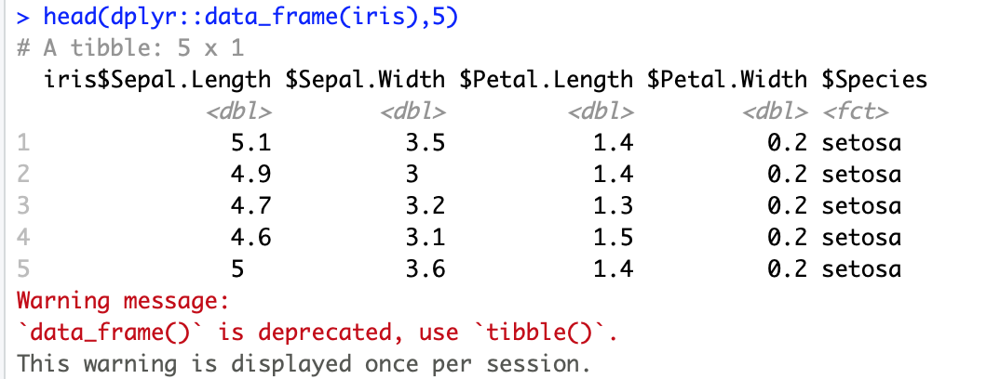
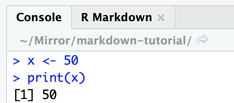

# Trouble-shooting {#trouble}

## Identifying issues

- Warnings vs. errors
- Console vs. chunk
- Markdown environment vs. R environment
- Package specification `::` for unloaded packages and conflicting functions

### Warnings

Warnings won't stop your document from compiling, but generally indicate that you should change something in your code.

```{r trouble_example_warn, echo=FALSE}

```

### Errors

There are different kinds of errors that you can encounter. In general, you can distinguish chunk errors from R Markdown errors by their appearance. Errors will usually tell you which line of the document they're in, but sometimes this can be misleading, so try to understand the error message first before going to look for the source. As always, Google and Stack Overflow are your friends!

Chunk error 

```{r trouble_example_chunk, echo=FALSE}
knitr::include_graphics("images/error_example.png")
```

R Markdown error

```{r trouble_example_mark, echo=FALSE}
knitr::include_graphics("images/error_conversion.png")
```

### R code and environments

Running a chunk executes the code in the console and adds the output to your R environment; however, your R environment is separate from the environment created when knitting a document. If you're getting an error message that says a particular variable or package doesn't exist when it's loaded in your R environment, it's usually because you haven't included it in a previous chunk.

```{r trouble_example_environ, echo=FALSE}

knitr::include_graphics("images/environment_var.png")
```

```{r environment, eval = FALSE}
# Define new variable y
y <- 100

# When I run this chunk, I get the expected output (150),
# but it fails when I try to knit the document
print(x + y)
```

### Packages

If a function you want to use isn't included in `base` R, you need to load the package that it's in (e.g., using `library(package)`). If you don't want to load a whole package, you can use this notation: `package::function`. This tells R which package to look in. You especially want to do this if there are what are called "namespace conflicts," where multiple packages have the same function name. I often run into this issue with the `filter` function from `dplyr`, so I always specify `dplyr::filter` even if I've loaded `dplyr`.

## Tips

- Clear all variables: `rm(ls = list())`
- Restart R environment: control/CTRL + fn + shift + F10
- Run all chunks individually **in order** before compiling to test code
- Search for information
  - Use Help window
  - Search for package in console with `?package` or `??package`
  - Google package and error