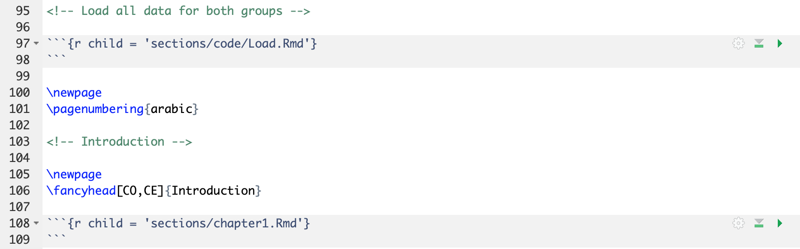
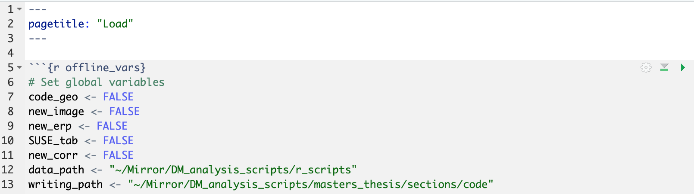
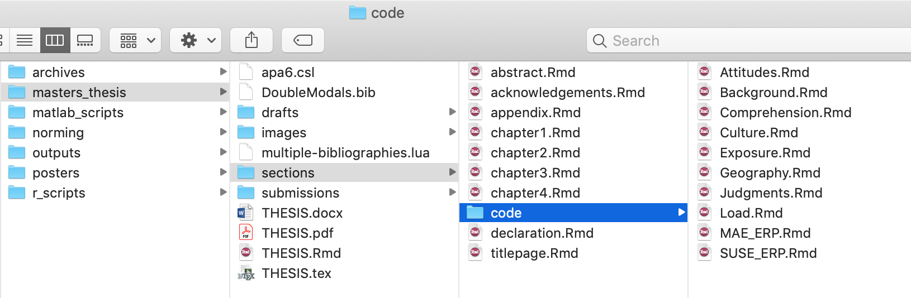
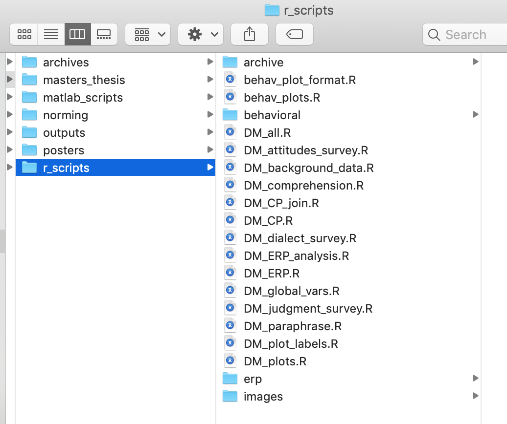

# Organization

If you're working on a large R Markdown project, like a thesis, it's inevitable that you will have several code chunks to perform pieces of one process (e.g., reformatting data for plotting and then creating the plots), and you will have lots of chapters/sections of markdown.

At a minimum, you want to keep your chunks small and name them for easy troubleshooting and use headers at multiple levels. One thing to note is that you cannot have the same chunk names anywhere in your document or sub-documents; this will throw an error. If you go to the bottom left-hand corner of your .Rmd file in RStudio, you'll see a small drop-down menu. There, you can jump to specific headers and code chunks.

As your documents grow, however, even these sections will become difficult to keep straight. This is when you want to use what are called *child* documents. This just means that you have separate R Markdown documents that you reference in your main R Markdown document. These are also great if you need to include the same code or text in multiple documents.

## Child documents

The screenshot below shows some code from my main Master's thesis R Markdown document. In this example, I referenced another R Markdown document called *Load*, as well as one called *chapter1*. All you have to do is make a code chunk in which you set the "child" parameter equal to the file that you want to reference (and file path if it's in a subfolder, as I have here). The chunk itself must be empty.

```{r content_child_call, echo=FALSE}

```

The *Load* document contained several code chunks for loading and processing my data and analyses for presentation. I've included a screenshot of the top of this document below. You can see that I just gave it a **pagetitle** in the YAML header, and then included the code chunks that I wanted. This helped keep the main document uncluttered.

One thing to note is that when you're running your code chunks to work on your document, if you just run the code chunk referencing the *child* document, nothing will happen. You have to open that R Markdown document and run it to evaluate those chunks.

```{r content_child_setup, echo=FALSE}

```

You also saw that I loaded the *chapter1* child document. This allowed me to separate out each of the sections of my thesis into different documents, in addition to separating out the analyses as with the *Load* document. I organized these documents into subfolders to keep everything clean. I've included a screenshot of the organizational structure below. 

At the top level, I had the main R Markdown document and necessary reference documents (see Section \@ref(yamlref) for more information on including reference documents in the YAML header). In the first subfolder, I had the documents for each section of the thesis (e.g., *chapter1* is the introduction). In the lower subfolder, I had documents that only contained code chunks (e.g., running statistical analyses and formatting the values for referencing).

```{r content_organization, echo=FALSE}

```

## Sourcing code

I also use a similar decentralized organizational structure for my actual R processing scripts. You can use `source(file)` to *source* all of the code from one script into another, similarly to using *child* documents in R Markdown. The *Load* document above actually *sources* R scripts in the code chunks to load those data into the thesis document.

I've included a screenshot of the folder with all of my R scripts for preparing my thesis data. The data themselves are in the *behavioral* and *erp* subfolders. The *DM_global_vars* file contains variables, like the custom formatting functions I described in Section \@ref(help), that I used across the scripts. I recommend having such a file that you *source* at the lowest level of the *sourcing*/*child* document hierarchy. That way, if you need to change something, you can make that change in just one place.

```{r content_organization_scripts, echo=FALSE}

```