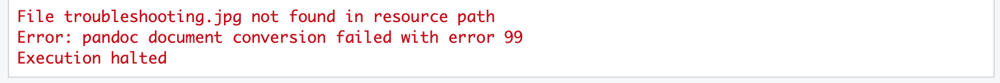

# Trouble-shooting

## Identifying issues

- Warnings vs. errors
- Console vs. chunk
- Markdown environment vs. R environment
- Package specification `::` for unloaded packages and conflicting functions

## Warnings

Warnings won't stop your document from compiling, but generally indicate that you should change something in your code

```{r trouble_example_warn, echo=FALSE}
knitr::include_graphics("images/warning_example.png")
```

## Errors

Chunk error 

```{r trouble_example_chunk, echo=FALSE}
knitr::include_graphics("images/error_example.png")
```

```{r trouble_example_mark, echo=FALSE}

```

## R code and environments

Running a chunk executes the code in the console and adds the output to your R environment; however, your R environment is separate from the environment created when "knitting" a document

```{r trouble_example_environ, echo=FALSE}
knitr::include_graphics("images/environment_console.png")
knitr::include_graphics("images/environment_var.png")
```

## R code and environments

```{r environment, eval = FALSE}
# Define new variable y
y <- 100

# When I run this chunk, I get the expected output (150),
# but it fails when I try to knit the document
print(x + y)
```

## Tips

- Clear all variables: `rm(ls = list())`
- Restart R environment: control/CTRL + fn + shift + F10
- Run all chunks individually **in order** before compiling to test code
- Search for information
  - Use Help window
  - Search for package in console with `?package`
  - Google package and error

Stack Overflow is your friend!