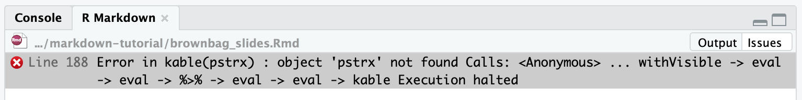

# Troubleshooting {#trouble}

1. Warnings vs. errors
2. RStudio vs. R Markdown environments
3. Package issues
4. Strategies for troubleshooting issues

## Warnings vs. errors

### Warnings

Warnings won't stop your document from compiling, but generally indicate that you should change something in your code.

```{r trouble_example_warn, echo=FALSE}
knitr::include_graphics("images/warning_example.png")
```

### Errors

There are different kinds of errors that you can encounter. 

In general, you can distinguish chunk errors from R Markdown errors by their appearance. 
Errors will usually tell you which line of the document they're in, but the line numbers can be misleading or inaccurate, so try to understand the error message first before going to look for the source. 
As always, Google and Stack Overflow are your friends!

Chunk error:

```{r trouble_example_chunk, echo=FALSE}

```

R Markdown error:

```{r trouble_example_mark, echo=FALSE}
knitr::include_graphics("images/error_conversion.png")
```

## Environments

Running a chunk executes the code in the console and adds the output to your R environment; however, your R environment is separate from the environment created when knitting a document. 
When you render your document, it ignores your R environment. 
`knitr` runs all of the chunks in order and knits them into the markdown text.

If you're getting an error message that says a particular variable or package doesn't exist when it's loaded in your R environment, it's usually because you haven't included it in a previous chunk.

```{r trouble_example_environ, echo=FALSE}
knitr::include_graphics("images/environment_console.png")

```

```{r environment, eval=FALSE}
# Define new variable y
y <- 100

# When I run this chunk, I get the expected output (150),
# but it fails when I try to knit the document
# I've set eval=FALSE for this chunk, so it doesn't try to run and prevent my document from knitting
print(x + y)
```

## Package issues 

### Package specification

If a function you want to use isn't included in `base` R, you need to load the package that it's in. The most basic way to do this is to run `library(package)` for each individual package. 
As you saw in my `setup` chunk example in Section \@ref(chunkex), my preferred way is to set a list of packages and then load them with the `p_load` function from the `pacman` package. 
This way, you can easily load multiple packages at once.

If you don't want to load a whole package, you can use this notation: `package::function`. This tells R which package to look in. 
You especially want to do this if there are what are called *namespace conflicts*, where multiple packages have the same function name. 
I often run into this issue with the `filter` function from `dplyr`, so I always specify `dplyr::filter` even if I've already loaded `dplyr`.

### Updates

You may get warnings related to packages being out of date or certain functions being *deprecated*. 
You may need to update packages and software that interact with R and R Markdown to get your code to run and documents to knit.
Depending on the feature that is out of date, there are different strategies for updating.

- [Update your TeX distribution](https://tex.stackexchange.com/questions/55437/how-do-i-update-my-tex-distribution) from the command line
- Update all packages (including `rmarkdown`) in library with `update.packages(path)` 
- Update individual packages by reinstalling with `install.packages("package")`
- Update R in the console with the `updateR` package
- Re-download RStudio to update

## Strategies

If you're running into any issues with rendering your document, here are some things you can try:

- Reset your R environment
  - Clear all variables by running `rm(ls = list())` in the console
  - Restart your R environment with CTRL/(control + fn) + shift + F10
  - Run all chunks individually **in order** before compiling to test code
- Search for information
  - Use Help window
  - Search for package in console with `?package` or `??package`
  - Google the error you're getting with the package or function you're trying to use